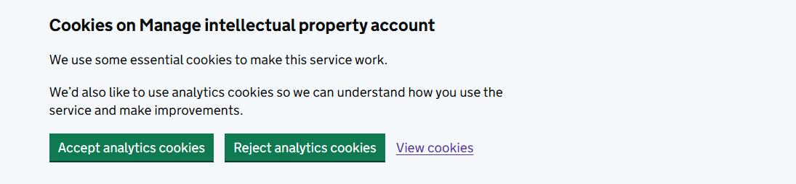
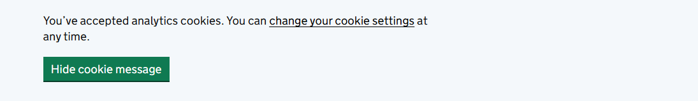

# GOV.UK Design System Cookie Banner UI Component
This component handles the cookie consent behaviour for GOV.UK websites and apps.
The user is prompted with a consent banner.
If the user accepts optional cookies, tracking begins and a confirmation banner is shown.

The user can also change their mind while the cookie banner is displayed.
A final option allows the user to hide the confirmation banner.

## Making this work
Copy the component code.
Modify the code to have your service name.
Add the necessary code to start optional cookie creating/tracking.

### Initial consent banner

### Confirmation banner

https://design-system.service.gov.uk/components/cookie-banner/